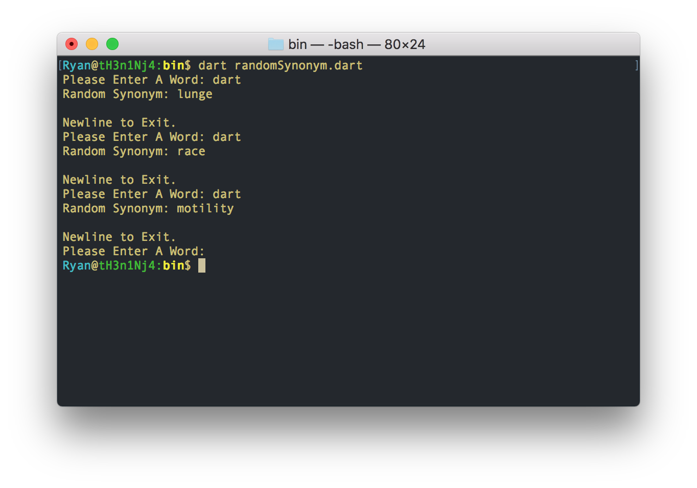

# Random Synonym Generator
A Random Synonym Generator built to test out the Dart language.

## Installation:
In order to run, the Dart SDK must be installed. More information on Dart installation can be found [here](https://www.dartlang.org/install#about-sdk-release-channels-and-version-strings). Once Dart is installed, open up terminal and navigate to the root folder of the repository and run:
```
pub get
```
Then, navigate into the 'bin' folder and run:
```
dart randomSynonym.dart
```

## Running:
Once the program is set up and run, it will ask the user for a valid alphabetical word. The synonyms for this word are then scraped from the web and a random one is returned. An example run is shown below: 


